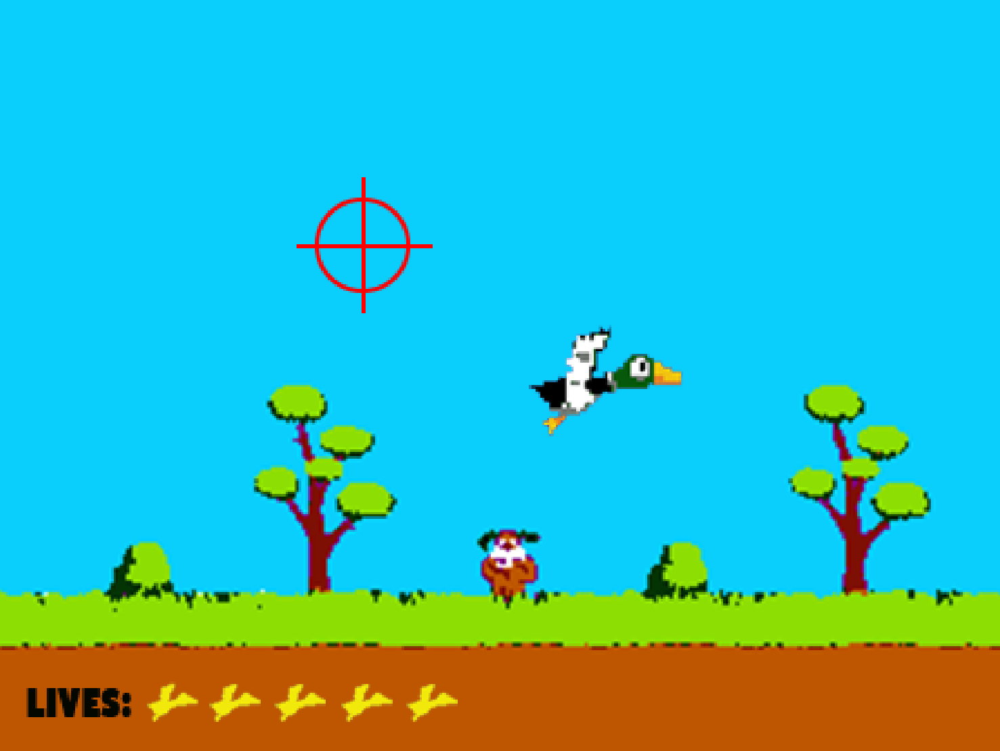

# DuckHunt-FPGA
Final Project for ECE 385 at the University of Illinois. A take of the classic NES game Duck Hunt, implemented on an FPGA using System Verilog.

https://www.youtube.com/watch?v=tvL7VH6HqG0

